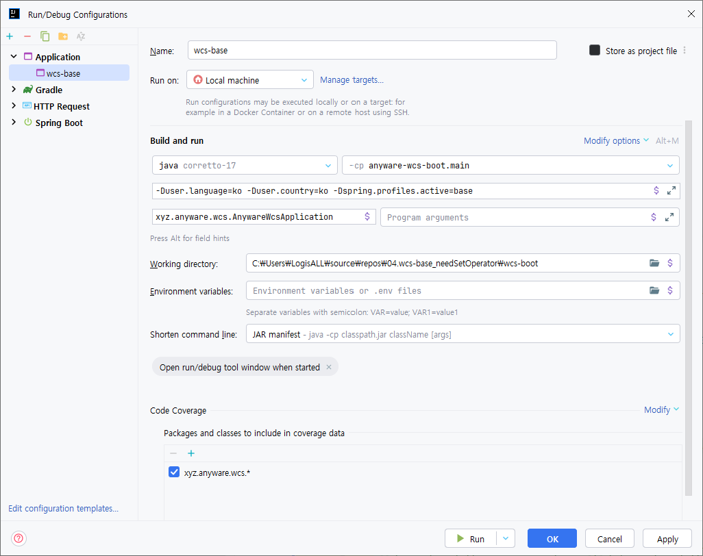

# WCS Base Framework

물류창고관리시스템(WCS) 구축용 **표준 프레임워크**입니다. 새 프로젝트 시작 시 본 베이스를 사용하면 **백엔드(Spring Boot) + 프론트엔드(Vue) + 운영 UI**까지 한 번에 세팅됩니다.

> 모든 WCS 프로젝트의 README를 **동일한 형식**으로 유지하기 위한 템플릿 겸 실사용 문서입니다.

---

## 📑 목차
1. [소개](#-소개)
2. [주요 특징](#-주요-특징)
3. [모노레포 구조](#-모노레포-구조)
4. [기술 스택](#-기술-스택)
5. [사전 준비물](#-사전-준비물)
6. [설치 & 실행](#-설치--실행)
7. [환경 변수 & 설정](#-환경-변수--설정)
8. [빌드 & 배포](#-빌드--배포)
9. [커밋 규칙 (Conventional Commits)](#-커밋-규칙-conventional-commits)
10. [디버깅 가이드](#-디버깅-가이드)
11. [자주 묻는 질문(FAQ)](#-자주-묻는-질문faq)
12. [로드맵](#-로드맵)

---

## 📖 소개

WCS 구축에 필요한 기본 코드를 미리 구성했습니다. 매번 처음부터 만들던 반복 작업을 제거하고, **공통 규약/구조/유틸**을 제공하여 프로젝트 착수 시간을 대폭 단축합니다.

**포함 구성:**
- **Spring Boot 백엔드** (`base_framework`)
- **Vue.js 운영 화면** (`vue-wcs-ui`) - [\[README 바로가기\]](./vue-wcs-ui/README.md)
- **PDA/KIOSK 화면** (`vue-ui-operator`) - [\[README 바로가기\]](./vue-ui-operator/README.md)
- **ECS 제어 인터페이스** (Shuttle, Lift, Conveyor 등)
- **Redis, PostgreSQL 연동**

---

## ✨ 주요 특징

- 백엔드/프론트/운영 UI **일관된 구조 & 스캐폴딩**
- 물류 도메인 표준 **엔티티/서비스/유틸** 제공
- **Shuttle/Lift/Conveyor** 등 ECS 연동 인터페이스 초안 포함
- **Redis** 기반 캐시·실시간 상태 관리
- **PostgreSQL** 기반 영속 계층 표준화
- 개발/운영 **프로필 분리**와 환경 변수 템플릿 제공
- **Conventional Commits** & 기본 CI를 고려한 폴더 구조

---

## 📦 모노레포 구조

```
wcs-base/
├─ wcs-boot/                 # Spring Boot 백엔드
│  ├─ src/main/java/...            # 도메인/서비스/컨트롤러
│  ├─ src/main/resources/
│  │  └─ application.properties
│  ├─ build.gradle
│  └─ settings.gradle
│
├─ logis-connector/
│  ├─ src/main/java/
│  ├─ operator/logis/connector/   
│  │  ├─integration.ecs/       # ECS 공통 모듈
│  │ 
│  ├─ src/main/resources/
│  │  ├─ application.yml
│  │  └─ application-{profile}.yml
│  ├─ build.gradle
│  └─ gradlew, gradlew.bat, settings.gradle
│
├─ vue-wcs-ui/                     # WCS 운영/모니터링 화면 (Vue 3 + Vite)
│  ├─ src/views
│  ├─ index.html
│  └─ package.json
│
├─ vue-ui-operator/                # PDA/KIOSK 등 작업자 화면 (Vue 3 + Vite)
│  ├─ src/views
│  ├─ index.html
│  └─ package.json
│
└─ README.md
```

---

## 🧰 기술 스택

- **Backend:** Java 17, Spring Boot 3.x, Gradle 8.x
- **Frontend:** Vue 3, Vite, TypeScript (선택), pnpm
- **DB / Cache:** PostgreSQL 14+, Redis 6+
- **통합:** (예) PLC(MELSEC Q 시리즈), AMR/AGV, 등 ECS 인터페이스 레이어

> 권장 JDK: **Eclipse Temurin 17+** (Oracle JDK는 라이선스 이슈 가능)

---

## 🧭 사전 준비물

- **JDK 17+** (Eclipse Temurin 권장)
- **Gradle 8.9+**
- **Node.js 18+ & pnpm 10+**
- **PostgreSQL 14+**
- **Redis** (미기동 시 서버 시작 실패)

> pnpm 설치가 없다면:
```bash
corepack enable
corepack prepare pnpm@10 --activate
# 또는
npm i -g pnpm
```

---

## ⚙️ 설치 & 실행

### 1) 저장소 가져오기
```bash
# 반드시 repos 폴더 내에서 진행
cd C:\Users\LogisALL\source\repos

git clone https://gitlab.logisall.com/anyware/wcs-base.git
```

### 2) 프론트엔드 패키지 설치 (중요: 먼저 설치)
두 프론트 프로젝트 **모두** 설치가 필요합니다.
```bash
# 방법 A: pnpm 권장
cd vue-wcs-ui && pnpm install && cd ..
cd vue-ui-operator && pnpm install && cd ..

# 방법 B: npx로 실행
cd vue-wcs-ui && npx pnpm install && cd ..
cd vue-ui-operator && npx pnpm install && cd ..
```

### 3) 백엔드 설정 & 실행
`wcs-base/src/main/resources/application-dev.properties` 생성 후 실행합니다.

```yaml
# application.properties
spring.datasource.name=Elidom
spring.datasource.driverClassName=org.postgresql.Driver
spring.datasource.url=jdbc:postgresql://10.30.1.32:5432/base?currentSchema=samsung
spring.datasource.username=changwon
spring.datasource.password=anyware1234!
spring.datasource.dbcp.max-active=50
```

### 4) 프론트엔드 실행
```bash
# 운영/모니터링 UI
cd vue-wcs-ui
npx pnpm run dev               # 기본 http://localhost:3100
# 새 터미널에서:
cd ../vue-ui-operator
npx pnpm run dev                # 기본 http://localhost:3200
```

### 5) 신규 모듈 생성 (필요 시에만)
1. `logis-wcs` Copy & Paste 후 모듈 명 지정
2. Gradle에 신규모듈 추가 [\[빌드-배포 가이드 바로가기\]](#-빌드--배포)
3. 파일/패키지 명 변경
    > src/resources/properties/logis-**wcs**.properties  
   > → src/resources/properties/logis-**[신규모듈명]**.properties  
 
    > src/main/java/operato/logis/**wcs**  
   > → src/main/java/operato/logis/**[신규모듈명]**  

    > src/main/java/operato/logis/**wcs**/initializer/Logis**Wcs**Initializer  
   > → src/main/java/operato/logis/**[신규모듈명]**/initializer/**Logis[신규모듈명]Initializer**

    > src/main/java/operato/logis/**wcs**/query/WcsQueryStore  
   > → src/main/java/operato/logis/**[신규모듈명]**/query/**[신규모듈명]QueryStore**

    > src/main/java/operato/logis/**wcs**/**Wcs**Constants  
   > → src/main/java/operato/logis/**[신규모듈명]**/**[신규모듈명]Constants**
4. 파일 변경
    ```bash
   #logis-[신규모듈]/README.md
   logis-[신규모듈명]
   
   신규모듈 설명
   ```
   ```bash
   #logis-[신규모듈]/src/main/resources/logis-[신규모듈명].properties
   'operator.logis.wcs.*' 항목을 'operator.logis.[신규모듈명].*' 으로 변경
    ```
    ```bash
   #logis-[신규모듈]/src/main/java/operato/logis/[신규모듈명]/config/ModuleProperties.java
   'wcs'를을 신규모듈명으로 변경
    ```
5. 미 사용시 폴더 삭제 
    > logis-[신규모듈]/src/main/resources/tspg/

---

## 🔧 환경 변수 & 설정

### Backend (Spring Boot)
- **properties 파일 생성:** <span style="color:red; background:#f4f7f9; padding:2px 4px; border-radius:4px;">application-[프로젝트명].properties</span>   
- **properties 필수 설정:**
    - `spring.datasource.url`, `username`, `password`, `dml.domain`
    - `spring.data.redis.host`, `spring.data.redis.port`
    - `server.port` (기본 `9500` 권장)
    - 필요 시 추가 : `dbist.base.entity.path=xyz.elidom,xyz.anythings,operato.logis.[모듈명]`
- **Intellij Run Configuration 설정:**
  1. `Edit Configurations...` → `Application` 추가
  2. More Options 체크항목:  
     - `Environment variables`
     - `Use classpath of module`, `Shorten command line`, `Add VM options`
     - `Specify classes and packages`
     - `Open run/debug tool window when started`
  3. 설정
      - module: `-cp anyware-wcs-boot.main`
      - VM Options: `-Duser.language=ko -Duser.country=ko`<span style="color:red; background:#f4f7f9; padding:2px 4px; border-radius:4px;">-Dspring.profiles.active=[프로젝트명]<span>  
      - Main class: `xyz.anyware.wcs.AnywareWcsApplication`
      - Environment variables: `키1=값1;키2=값2`  
      - Shorten command line: `JAR manifest`
      - Code Coverage: `xyz.anyware.wcs.*`
- <details style="background-color: #e7f3ff; padding: 2px 6px;"><summary style="font-weight: bold;">모듈 특화 설정 [클릭]</summary>

  - **logis-lms 모듈 설정:**
    1. `[gitlab] - [Settings] - [CI/CD] - [Variables]`에서 `[APP_ADDRESS_AES_KEY_B64]`, `[APP_EDGE_SERVER_AES_KEY_B64]`, `[APP_PERSONAL_INFO_AES_KEY_B64]`, `[EMAIL_APP_KEY]` 값 복사   
    2. Intellij Run Configuraiton 설정 Environment vaiables에 추가
        ```
        APP_ADDRESS_AES_KEY_B64=값1;APP_EDGE_SERVER_AES_KEY_B64=값2;APP_PERSONAL_INFO_AES_KEY_B64=값3;EMAIL_APP_KEY=값4
        ```
  </details>



### Frontend (Vite)
- **필수 설정:**
  - server port 변경 (기본 `9500` 권장) 
     ```dotenv
    # .env (vue-wcs-ui, vue-ui-operator 공통)
    VITE_PROXY=[["/rest","http://localhost:9500/rest"],["/upload","http://localhost:9500/upload"]]
  
    NEAR_REQUEST_URL = http://localhost:9500/rest
    NEAR_UPLOAD_URL = http://localhost:9500/upload
    ```
  - project name 변경  
    1. vue-wcs-ui/src/views 내에 <span style="color:red; background:#f4f7f9; padding:2px 4px; border-radius:4px;">dashboard_[프로젝트명]</span> 폴더 생성
    2. `dashboard_[프로젝트명]/index.vue` 파일 생성 : 메인에 표기될 화면
    3. 프로젝트 명 변경 (미 지정 시 `dashboard_base` 반영)
    ```dotenv
    # .env (vue-wcs-ui only)
    VITE_PROJECT=[프로젝트명]
    ```
- <details style="background-color: #e7f3ff; padding: 2px 6px;"><summary style="font-weight: bold;">모듈 특화 설정 [클릭]</summary>

  - **logis-lms 모듈 설정:**
    1. `[gitlab] - [Settings] - [CI/CD] - [Variables]`에서 `[VITE_NAVER_MAP_KEY]` 값 복사
    2. `vue-wcs-ui` 환결설정에 추가
        ```dotenv
        # .env
        VITE_NAVER_MAP_KEY=여기에_복사한_값_붙여넣기
        ```
  </details>

### 포트 권장값
- **Backend:** `9500`
- **vue-wcs-ui:** `3100`
- **vue-ui-operator:** `3200`

---

## 📦 빌드 & 배포
- **모듈 추가 시 설정:**
  - 빌드에 사용할 모듈만 지정 후, `Sync all gradle Projects`  
    ```java
    // wcs-boot/build.gradle
    dependencies {
      ...
      implementation project(':logis-[추가할 모듈명]')
    }
    ``` 
    ```java
    // wcs-boot/setting.gradle
    include ':logis-wcs',
            ':logis-connector',
            ':logis-[추가할 모듈명]'
  
    project(':logis-wcs').projectDir = new File(settingsDir, '../logis-wcs')
    project(':logis-connector').projectDir = new File(settingsDir, '../logis-connector')
    project(':logis-[추가할 모듈명]').projectDir = new File(settingsDir, '../logis-[추가할 모듈명]')
    ```  
- 참고: [32번 서버 배포 가이드 \[바로가기\]](https://logisall.dooray.com/task/view/tasks/4233525562713980333)  

---

## 📝 커밋 규칙 (Conventional Commits)

- 참고 : [Commit Rule \[바로가기\]](https://logisall.dooray.com/wiki/3642858987372535639/4154449387255703921)  
---

## 🪛 디버깅 가이드

- **포트 충돌(예: 9500)**: 사용 중인 프로세스 종료 후 재시작
- **Redis 미기동**: 백엔드 기동 실패 → Redis 먼저 실행
- **DB 연결 오류**: `spring.datasource.*` 값 확인, 로컬 포트/계정 점검

---

## ❓ 자주 묻는 질문(FAQ)

---

## 🗺 로드맵

- [ ] TSPG ECS 인터페이스 표준 모듈화 (Shuttle/Lift/Conveyor)
- [ ] 운영자 대시보드 기본 위젯 템플릿 제공
- [ ] WCS 공통 도메인 확장
- [ ] 샘플 데이터/시뮬레이터 제공
---