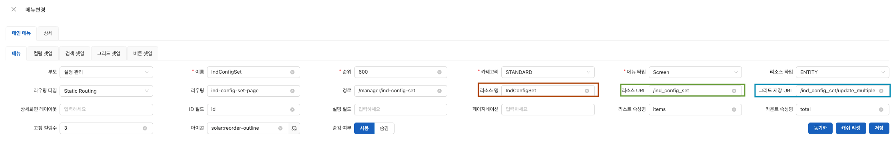

# ANYWARE WCS

--- 

## 📑 목차

<!-- TOC -->
1. [사전 준비물](#-사전-준비물)
2. [Based On](#-based-on)
3. [사용지침서](#-사용지침서)
4. [Install and use](#install-and-use)
5. [Change Log](#change-log)
6. [Related Project](#-related-project)
7. [Browser support](#browser-support)
<!-- TOC -->

--- 

## 🧭 사전 준비물

**필수**
- [Git](https://git-scm.com/)
- [Node.js 18+](http://nodejs.org/) & pnpm 10+
- [Vite](https://vitejs.dev/) / [Vue3](https://v3.vuejs.org/) / [Vue-Router-Next](https://next.router.vuejs.org/) 
- [TypeScript](https://www.typescriptlang.org/)
- [Mock.js](https://github.com/nuysoft/Mock)

**VSCode Plugin**
  - `TypeScript Vue Plugin (Volar)` : TS에서 \*.vue 문서를 인식
  - `Iconify IntelliSense` : Iconify preview제공
  - `windicss IntelliSense` : windicss 코드 도움
  - `I18n-ally` : i18n번역 처리
  - `ESLint`, `Prettier` : 코드포맷팅
  - `Stylelint` : CSS 코드포맷팅
  - `DotENV` : .env highlight

## 🏗️ Based On
- [vue-vben-admin](https://vben.vvbin.cn/) : Full version Chinese site
  - [Github](https://github.com/anncwb/vue-vben-admin) : Full version
- [vben-admin-thin-next](https://vben.vvbin.cn/thin/next/) : Simplified Chinese site
  - [Github](https://github.com/anncwb/vben-admin-thin-next) : Simplified version
- [Ant-Design-Vue](https://2x.antdv.com/docs/vue/introduce-cn/) : UI Basic use
- [EChart](https://echarts.apache.org/en/api.html#echarts) : Chart UI Basic use


## ⚙️ 설치 & 실행

### 초기세팅
메인화면 변경
1. `views` 하위에 `base_[프로젝트명]` directory 생성
2. 환경변수 파일 변경
    ```typescript
    // .env
    
    VITE_PROJECT=[프로젝트명]
    ```

## 📜 사용지침서

**메뉴별 지침서**
- 공통 레이아웃 사용지침서 [\[바로가기\]](docs/manual/Common-Layout.md)
- [Tool > 엔티티] 사용지침서 [\[바로가기\]](docs/manual/Tool-01-Entity.md)
- [시스템 > 메뉴] 및 라우팅 사용지침서 [\[바로가기\]](docs/manual/System-03-Menu.md)
- [권한 관리 > 역할] 사용지침서 [\[바로가기\]](docs/manual/Permission-02-Role.md)

**추가 지침서**
- [공통 화면](#공통-화면)
- [커스텀 화면](#커스텀-화면)
- [master/detail 그리드](#masterdetail-그리드)

--- 
### 공통 화면

Button, Modal 등을 각 화면에 맞게 넣어줍니다.

Button의 경우 아래와 같이 구성한 후, onMounted에서 필요한 버튼들을 넣습니다. 해당 기능은 listener를 통해 구현합니다.

```javascript
<template>
  <CommonPage
    ref="commPageRef"
    @gridClicked="changeButtonList"
    @gridChecked="onGridChecked"
    :limit="limit"
  >
    <Button
      v-for="button in buttons"
      :danger="button.danger"
      @click="button.listener"
      type="primary"
      :hidden="button.hidden == 1"
      >{{ t(button.title) }}</Button
    >
  </CommonPage>
</template>
```


```javascript
onMounted(() => {
  buttons.value = [
    {
      name: 'clearCache',
      title: 'button.clear_cache',
      auth: 'update',
      hidden: 0,
      listener: clearCache,
    },
    {
      name: 'addRow',
      title: 'button.add',
      auth: 'create',
      hidden: 0,
      listener: addRow,
    },
    {
      name: 'saveRows',
      title: 'button.save',
      auth: 'update',
      hidden: 0,
      listener: saveRows,
    },
    {
      name: 'deleteRows',
      title: 'button.delete',
      auth: 'delete',
      hidden: 0,
      listener: deleteRows,
    },
  ];
});
```

### 커스텀 화면

1. modal 등의 파일이 없는 경우, index.vue 단독 파일을 생성하는 경우 폴더를 만들지 않고 파일명을 Index.vue가 아닌 파일명.vue로 적어줍니다. 예를 들어, job-config-set.vue로 만들어줍니다.

2. [메뉴 → 컬럼 셋업]에서 '리소스명'에 [Tool > 엔티티] 값을 적어준 후 동기화를 클릭하면 '컬럼 셋업', '검색 셋업' 등을 불러올 수 있습니다. 기존의 컬럼들과 매칭이 되는지 확인하고 id 필드를 숨기고 싶으면 '필드 '컬럼 편집'에서 'hidden'으로 변경합니다. 예외 diy 인 경우는 리소스명을 '공백'으로 두고 직접 '컬럼 셋업', '검색 셋업' 등을 기존의 .json 파일을 참고해서 작성합니다.

3. 다음 코드 부분에서 해당하는 resourceUrl.value는 [메뉴 → 컬럼 셋업]의 '리소스 URL'입니다. 빈 값이면 해당 값을 넣어줍니다.

```javascript
const response = await getSearchList(resourceUrl.value, requestParams);
```

4. 그리드를 추가하거나 수정한 경우 다음 코드 부분에서 gridSaveUrl.value는 [메뉴]의 '그리드 저장 URL'입니다. 빈 값이면 해당 값을 넣어줍니다. (형식: 리소스 URL/update/multiple) [메뉴 → 컬럼 셋업]의 값을 변경하고 나면 redis에 저장된 정보가 있기 때문에 [캐시리셋], [동기화] 버튼을 클릭하여 수정된 내용으로 저장될 수 있게 해줍니다.

```javascript
let response = await updateList(gridSaveUrl.value, patches);
```



6. "onClick 부분과 filterCols 부분을 화면에 맞게 변경합니다. 커스텀한 예시는 'Git'에서 2023년 10월 24일에 commit 된 '공통화면 처리 샘플'을 참고합니다.
7. 
8. Modal의 경우 modal 창을 구성할 파일을 만든 후 index.vue 파일에서 import 해줍니다. 그리고 테그를 통해 넣어줍니다.

만약 Modal 창이 여러 개인 경우에는 register 명을 다르게 주어 구분하도록 합니다.

```javascript
<ChangeIndicatorModal
@register="registerIndicatorModal"
@success="handleSuccess"
width="450px"
/>
<LightOnModal
  @register="registerLightModal"
  @success="handleSuccess"
  width="800px" />
</CommonPage>
```

8. 화면에서 다른 데이터를 가져오고 싶으면 <CommonPage> 테그 끝에 menuName을 적어주면 해당 데이터를 불러올 수 있습니다.

```javascript
<template>
 <BasicModal v-bind="$attrs" @register="registerModal" :title="getTitle" @ok="handleSubmit">
   <div class="modal-size">
     <CommonPage
       ref="commPageRef"
       menuName="Rack"
       :limit="100"
       :fetchHandler="fetchRackHandler"
       :showSearchForm="false"
       :showButtons="false"
     />
   </div>
 </BasicModal>
</template>
```

### master/detail 그리드

1. 상하 그리드의 경우 src > views > common > TopBottomSample.vue를 사용하고, 좌우 그리드의 경우 src > views > common > LeftRightSample.vue 를 사용합니다.

2. master/detail 그리드를 구분하기 위해 각각의 ref를 적어줍니다.

```javascript
<template>
  <PageWrapper>
    <Layout class="gap-1">
      <Sider width="50%">
        <CommonPage
          ref="masterRef"
          @gridClicked="onClick"
          :baseColProps="{ xxl: 12, lg: 24, md: 24, sm: 24 }"
        >
          <Button type="primary" @click="addMasterRow">{{ t('button.new') }}</Button>
          <Button type="primary" @click="saveMasterRows">{{ t('button.save') }}</Button>
          <Button danger @click="deleteMasterRows">{{ t('button.delete') }}</Button>
        </CommonPage>
      </Sider>
      <Content>
        <CommonPage
          ref="detailRef"
          :baseColProps="{ xxl: 12, lg: 24, md: 24, sm: 24 }"
          :limit="100"
          :metaUrl="metaUrl"
          menuMetaProp="0"
          :showSearchForm="false"
          :fetchHandler="detailFetchHandler"
        >
          <Button type="primary" @click="addDetailRow">{{ t('button.new') }}</Button>
          <Button type="primary" @click="saveDetailRows">{{ t('button.save') }}</Button>
          <Button danger @click="deleteDetailRows">{{ t('button.delete') }}</Button>
        </CommonPage>
      </Content>
    </Layout>
  </PageWrapper>
</template>
```

3. detailFetchHandler를 통해 가져온 값이 배열인 경우, 다음과 같이 처리해줍니다.

```javascript
const response = await getSearchList(resourceUrl.value);
if (Array.isArray(response)) {
  return {
    total: response.length,
    records: response,
  };
} else {
  return {
    total: response.total,
    records: response.items,
  };
}
```

## Install and use

`.env`, `.env.*` 파일 수정 시 전역 세팅 추가

```ts
// src/hooks/setting/index.ts
const {
  VITE_GLOB_APP_TITLE,
  VITE_GLOB_API_URL,
  VITE_GLOB_APP_SHORT_NAME,
  VITE_GLOB_API_URL_PREFIX,
  VITE_GLOB_UPLOAD_URL,
} = ENV;

export const useGlobSetting = (): SettingWrap => {
  const glob: Readonly<GlobConfig> = {
    title: VITE_GLOB_APP_TITLE,
    apiUrl: VITE_GLOB_API_URL,
    shortName: VITE_GLOB_APP_SHORT_NAME,
    urlPrefix: VITE_GLOB_API_URL_PREFIX,
    uploadUrl: VITE_GLOB_UPLOAD_URL,
  };
  return glob as Readonly<GlobConfig>;
};
```

- nginx config

```nginx
# nginx
location / {
  # not cache html
  if ($request_filename ~* .*\.(?:htm|html)$) {
    add_header Cache-Control "private, no-store, no-cache, must-revalidate, proxy-revalidate";
    access_log on;
  }
  # dist file location
  root   /srv/www/project/;
  index  index.html index.htm;
}

# nginx with thistory
server {
    listen       80;
    server_name  localhost;
    location / {
      # not cache html
      if ($request_filename ~* .*\.(?:htm|html)$) {
        add_header Cache-Control "private, no-store, no-cache, must-revalidate, proxy-revalidate";
        access_log on;
      }
      # dist file location
      alias   /srv/www/project/;
      index index.html index.htm;
      try_files $uri $uri/ /sub/index.html;
    }
}

# nginx cross origin
server {
  listen       80;
  server_name  localhost;
  location / {
    # not cache html
    if ($request_filename ~* .*\.(?:htm|html)$) {
      add_header Cache-Control "private, no-store, no-cache, must-revalidate, proxy-revalidate";
      access_log on;
    }
    # dist file location
    alias   /srv/www/project/;
    index index.html index.htm;
    try_files $uri $uri/ /sub/index.html;
  }
  location /rest {
    proxy_set_header Host $host;
    proxy_set_header X-Real-IP $remote_addr;
    proxy_set_header X-Forwarded-For $proxy_add_x_forwarded_for;
    # 后台接口地址
    proxy_pass http://host:9500/rest;
    proxy_redirect default;
    add_header Access-Control-Allow-Origin *;
    add_header Access-Control-Allow-Headers X-Requested-With;
    add_header Access-Control-Allow-Methods GET,POST,OPTIONS;
  }
}

# nginx gzip or brotli setup
http {
  # gzip사용
  gzip on;

  # gzip_static 사용
  # gzip은 nginx package가 필요할 수 있어 추가로 설치해야 함
  gzip_static on;
  gzip_proxied any;
  gzip_min_length 1k;
  gzip_buffers 4 16k;

  # proxy처리하는 경우 gzip에 아래와 같은 설정이 필요하다
  gzip_http_version 1.0;
  gzip_comp_level 2;
  gzip_types text/plain application/javascript application/x-javascript text/css application/xml text/javascript application/x-httpd-php image/jpeg image/gif image/png;
  gzip_vary off;
  gzip_disable "MSIE [1-6]\.";

  # brotli사용
  # brotli은 nginx package가 필요할 수 있어 추가로 설치해야 함
  # brotli와 gzip은 충돌하지 않는다.
  brotli on;
  brotli_comp_level 6;
  brotli_buffers 16 8k;
  brotli_min_length 20;
  brotli_types text/plain text/css application/json application/x-javascript text/xml application/xml application/xml+rss text/javascript application/javascript image/svg+xml;
}
```

## Change Log

[CHANGELOG](./CHANGELOG.md)


## 📂 Related Project

If these plugins are helpful to you, you can give a star support  
- [vite-plugin-mock](https://github.com/anncwb/vite-plugin-mock) - Used for local and development environment data mock
- [vite-plugin-html](https://github.com/anncwb/vite-plugin-html) - Used for html template conversion and compression
- [vite-plugin-compression](https://github.com/anncwb/vite-plugin-compression) - Used to pack input .gz|.brotil files
- [vite-plugin-svg-icons](https://github.com/anncwb/vite-plugin-svg-icons) - Used to quickly generate svg sprite

## Browser support
The `Chrome 80+` browser is recommended for local development

Support modern browsers, not IE

| [](http://godban.github.io/browsers-support-badges/)</br>IE | [](http://godban.github.io/browsers-support-badges/)</br>Edge | [](http://godban.github.io/browsers-support-badges/)</br>Firefox | [](http://godban.github.io/browsers-support-badges/)</br>Chrome | [](http://godban.github.io/browsers-support-badges/)</br>Safari |
| :-: | :-: | :-: | :-: | :-: |
| not support | last 2 versions | last 2 versions | last 2 versions | last 2 versions |
