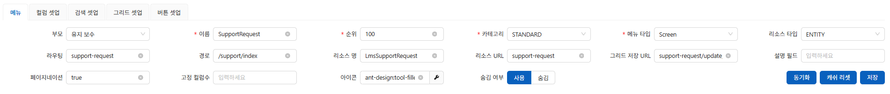
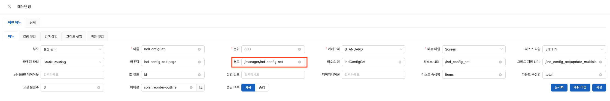
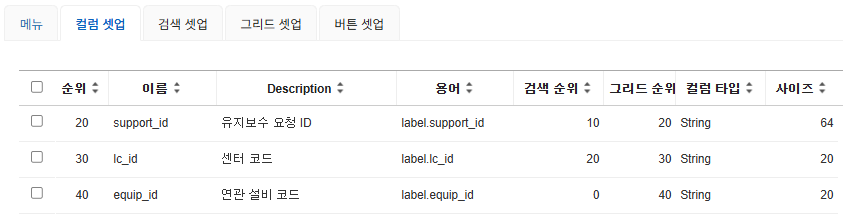
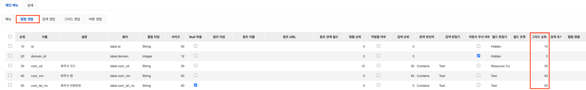
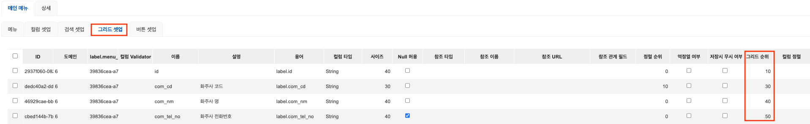
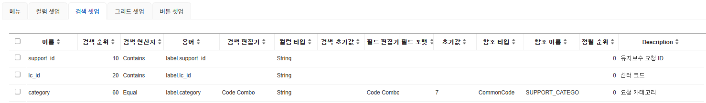
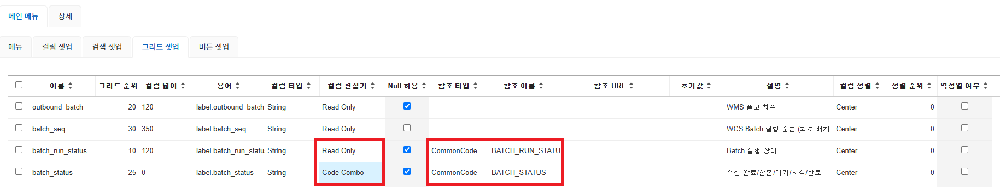
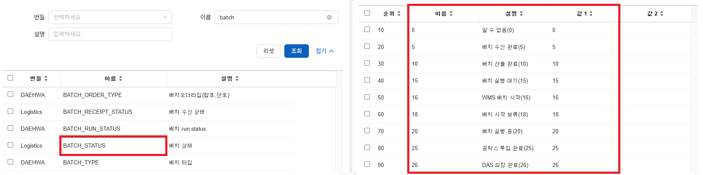
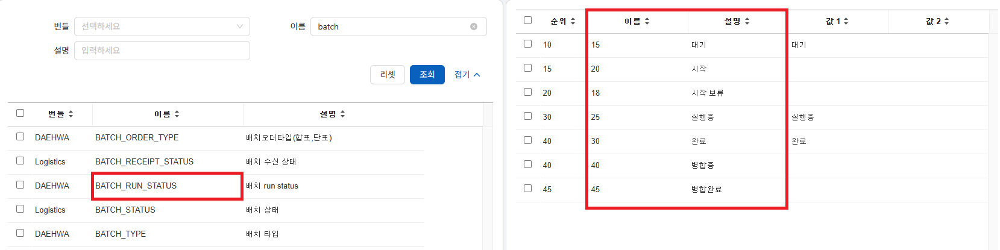

# Menu 설정 및 Routing 가이드

## 목차
<!-- TOC -->
* [1. 설명](#1-설명)
* [2. 메뉴 설정](#2-메뉴-설정)
  * [2-1. 메뉴 추가](#2-1-메뉴-추가)
  * [2-2. 용어 추가](#2-2-용어-추가)
* [3. 컬럼 셋업](#3-컬럼-셋업)
  * [3-1. 컬럼 추가](#3-1-컬럼-추가)
  * [3-2. 용어 추가](#3-2-용어-추가)
* [4. 검색 셋업](#4-검색-셋업)
  * [4-1. 검색 컬럼 추가](#4-1-검색-컬럼-추가)
  * [4-2. 검색 필드 설정](#4-2-검색-필드-설정)
* [5. 그리드 셋업](#5-그리드-셋업)
  * [5-1. 그리드 컬럼 추가](#5-1-그리드-컬럼-추가)
  * [5-2. 그리드 필드 설정](#5-2-그리드-필드-설정)
  * [5-3. 공통코드 사용 설정](#5-3-공통코드-사용-설정)
* [6. 버튼 셋업](#6-버튼-셋업)
* [7. 라우팅 사용](#7-라우팅-사용)
  * [7-1. case1) 파라미터 전달 미포함](#7-1-case1-파라미터-전달-미포함)
  * [7-2. case2) 파라미터 전달 포함](#7-2-case2-파라미터-전달-포함)
<!-- TOC -->

--- 

## 1. 설명

본 문서는 메뉴 정의 및 라우팅 연결 로직의 사용 지침을 담고 있습니다.

## 2. 메뉴 설정
### 2-1. 메뉴 추가
| 항목 | 설명                                                                                                           | 예시 / 기본값                                                                                               |
| :--- |:-------------------------------------------------------------------------------------------------------------|:-------------------------------------------------------------------------------------------------------|
| **부모** | 상위 메뉴. 미 지정 시 부모 메뉴로 간주                                                                                      | -                                                                                                      |
| **이름** | '용어'로 변경될 메뉴 명                                                                                               | `CutomPage`                                                                                            |
| **순위** | 자식 메뉴 순서                                                                                                     | `1000`                                                                                                 |
| **카테고리** | 화면 유형 설정</br> • `STANDARD`: 웹 화면</br> • `TERMINAL`</br> • `KIOST`</br> • `TABLET`</br> • `PDA`               | default: `STANDARD`                                                                                    |
| **메뉴 타입** | 메뉴 형태 구분</br> • `MENU`</br> • `Screen`</br> • `Separator`</br> • `Template`</br> • `Hidden`</br> • `Operato` | default: `Screen`                                                                                      |
| **리소스 타입** | 리소스 종류 구분</br> • `ENTITY`</br> • `DIY_SERVICE`</br> • `DIY_GRID`                                             | default: `ENTITY`                                                                                      |
| **라우팅** | 클라이언트 사이드 라우팅                                                                                                | `cutom/route-test`                                                                                     |
| **경로** | vue 파일 경로                                                                                                    | 공통컴포넌트 사용 시</br> • `/common/index`</br> • `/common/CommonPage`</br>커스텀 컴포넌트 사용시</br> • `[/view 하위 경로]` |
| **리소스 명** | 리소스 식별자 명칭                                                                                                   | `Custom`                                                                                               |
| **리소스 URL** | API 라우팅 주소                                                                                                   | `/custom` (/rest 제외)                                                                                   |
| **그리드 저장 URL** | "저장" 버튼 클릭 시 요청할 API 주소                                                                                      | `/custom/update_multiple` ([리소스url/update_multiple] 형식)                                                |
| **설명 필드** | 메뉴에 대한 추가 설명                                                                                                 | -                                                                                                      |
| **페이지네이션** | UI 내 페이지네이션 사용 여부                                                                                            | `true` / `false`                                                                                       |
| **고정 컬럼수** | 그리드 내 고정될 컬럼의 개수                                                                                             | `3`                                                                                                    |
| **아이콘** | 메뉴 좌측에 노출될 아이콘                                                                                               | -                                                                                                      |
| **숨김 여부** | 메뉴 노출 여부                                                                                                     | default `null(숨김) `                                                                                     |

- 메뉴 설정 예시
  

- 공통 화면 설정 예시
  

### 2-2. 용어 추가
메뉴 명에 대한 다국어 설정을 추가합니다. [시스템]-[용어 정의]-[추가] 이동 후 아래 항목을 작성합니다.
- **카테고리** : `Menu`
- **언어** : `한글, English, 中文` 모두 추가
- **이름** : `매뉴 설정 - 이름`과 동일한 값
- **표현** : 화면에 표기될 값

## 3. 컬럼 셋업
### 3-1. 컬럼 추가
해당 메뉴에 사용할 컬럼을 설정합니다. 검색 셋업과 그리드 셋업의 기반이 됩니다.

| 항목              | 설명                              | 예시 / 기본값                           |
|:----------------|:--------------------------------|:-----------------------------------|
| **순위**          | 컬럼 정렬 순서                        | `10`                               |
| **이름**          | 컬럼 명(snake_case)                | `test_col1`                        |
| **Description** | 개발자 편의를 위한 설명               | `테스트용 컬럼`                          |
| **용어**          | 화면에 표시될 컬럼 명</br>용어 설정값으로 자동 변경 | `label.[컬럼명]` 형식                   |
| **검색 순위**       | 검색 조건 내 노출 순서                   | `0` (기본값, 검색 조건에 미사용)              |
| **그리드 순위**      | 그리드 목록 내 노출 순서                  | `0` (기본값, 미노출)                     |
| **컬럼 타입**       | 데이터 타입                          | default: `String`                  |
| **사이즈**         | 표시될 데이터의 크기                     | Datetime: `0`<br/>varchar(3): `3` |

- 컬럼 설정 예시
 

- 검색 필드로 사용할 컬럼 설정 예시 
  

- 그리드 조회에 추가할 컬럼 설정 예시
  

### 3-2. 용어 추가
컬럼 명에 대한 다국어 설정을 추가합니다. [시스템]-[용어 정의]-[추가] 이동 후 아래 항목을 작성합니다.
- **카테고리** : `label`
- **언어** : `한글, English, 中文` 모두 추가
- **이름** : `컬럼별 용어의 label.뒤의 값`과 동일한 값
- **표현** : 화면에 표기될 값

## 4. 검색 셋업
### 4-1. 검색 컬럼 추가
컬럼 셋업에서 검색순위가 0 초과인 컬럼이 자동으로 추가됩니다.  
필요한 경우 `추가`버튼으로 검색 조건을 생성합니다.

### 4-2. 검색 필드 설정
| 항목              | 설명                    | 예시 / 비고                                                                                                                                   |
|:----------------|:----------------------|:------------------------------------------------------------------------------------------------------------------------------------------|
| **이름**          | 컬럼 명(snake_case)      | 변경 시 '컬럼셋업' 반영                                                                                                                            |
| **검색 순위**       | 검색 UI 노출 순서           | 변경 시 '컬럼셋업' 반영. `10`, `20`, ...                                                                                                           |
| **용어**          | 화면 표시 명칭              | 변경 시 '컬럼셋업' 반영. `label.[컬럼명]` 형식                                                                                                          |
| **컬럼 타입**       | 데이터의 타입               | 변경 시 '컬럼셋업' 반영.                                                                                                                           |
| **Description** | 개발자 편의를 위한 설명         | 변경 시 '컬럼셋업' 반영                                                                                                                            |
| **검색 연산자**      | 검색 시 적용할 논리 연산자       | -                                                                                                                                         |
| **검색 편집기**      | 검색 UI 컴포넌트            | `Text`/`Textarea`: 텍스트 필드<br/>`Number`: 숫자 필드<br/>`Checkbox`: 체크박스 필드<br/>`Code Combo`: 공통코드에 젇의된 목록 Select 필드<br/>`Date Picker`: 날짜 필드 등 |
| **검색 초기값**      | (Optional) -          | -                                                                                                                                         |
| **필드 편집기**      | 그리드 내 입력 컴포넌트 타입      | -                                                                                                                                         |
| **필드 포맷**       | (Optional) 데이터 표시 형식  | -                                                                                                                                         |
| **초기 값**        | (Optional) -          | -                                                                                                                                         |
| **참조 타입**       | (Optional) 데이터 참조 방식  | 공통코드 사용 시 `CommonCode` 선택                                                                                                                 |
| **참조 이름**       | (Optional) 참조할 대상의 명칭 | 공통코드 사용 시 `[공통코드 명]`                                                                                                                      |
| **정렬 순위**       | -                     | default: `0`                                                                                                                               |
| **설명**          | (Optional) -          | -

- 검색 셋업 예시
  

## 5. 그리드 셋업
### 5-1. 그리드 컬럼 추가
컬럼 셋업에서 그리드순위가 0 초과인 컬럼이 자동으로 추가됩니다.  
필요한 경우 `추가`버튼으로 그리드 필드를 생성합니다.

### 5-2. 그리드 필드 설정
모든 컬럼 넓이가 0으로 지정된 경우 자동으로 간격을 조정하지만 데이터가 잘려서 보일 수 있으므로, 사용하는 모든 컬럼의 넓이를 지정하는 것을 권장합니다.

| 항목 | 설명                              | 예시 / 비고                                                                                                                             |
| :--- |:--------------------------------|:------------------------------------------------------------------------------------------------------------------------------------|
| **이름** | 컬럼 명(snake_case)                | 컬럼 셋업에서 자동 추가                                                                                                                       |
| **그리드 순위** | 노출 순서                           | 컬럼 셋업에서 자동 추가                                                                                                                       |
| **용어** | 화면 표시 명칭                        | 컬럼 셋업에서 자동 추가                                                                                                                       |
| **컬럼 타입** | 데이터 타입                          | 컬럼 셋업에서 자동 추가                                                                                                                       |
| **Description** | (Optional) 개발자 편의를 위한 설명        | 컬럼 셋업에서 자동 추가                                                                                                                       |
| **컬럼 넓이** | 컬럼 별 고정 너비                      | 10단위 숫자. default: `0 (자동 너비 조정)`                                                                                                    |
| **컬럼 편집기** | 그리드 입력 UI 컴포넌트                  | `Read Only`: 수정불가<br/>`Checkbox`: 체크박스<br/>`Text`/`Textarea`: 텍스트<br/>`Code Combo`: 목록선택<br/>`Number`: 숫자<br/>`Date Picker`: 날짜선택 등 |
| **Null 허용** | 저장 시 컬럼 속성                      | default: `false (null허용)`                                                                                                           |
| **참조 타입** | (Optional) 데이터 참조 방식            | 공통코드 사용 시 `CommonCode` 선택. 변경 시 '검색셋업' 반영                                                                                           |
| **참조 이름** | (Optional) 참조할 대상의 명칭           | 공통코드 사용 시 `[공통코드 명]`. 변경 시 '검색셋업' 반영                                                                                                |
| **참조 URL** | (Optional)외부 데이터 호출이 필요한 경우의 주소 | -                                                                                                                                   |
| **초기값** | (Optional) -                    | 변경 시 '검색셋업' 반영                                                                                                                      |
| **정렬 순위** | 그리드 데이터 기본 정렬 우선순위              | default: `0`                                                                                                                        |
| **역정렬 여부** | 내림차순 정렬 여부                | default: `false(오름차순)`|

### 5-3. 공통코드 사용 설정

공통코드는 "이름"과 일치하는  "설명"으로 변환되어 표기됩니다.  
조회 시에는 "설명"으로 표기되고, 수정/저장 시 값은 "값1"로 전달됩니다.

- 컬럼셋업 공통코드 설정 예시
  - 참조 타입 : `CommonCode`
  - 참조 이름 : `[공통 코드명]`
 

- 공통코드 설정 예시
  1. [시스템]-[공통 코드]-[추가]
  2. 번들, 이름, 설명 작성 후 저장
  3. 해당 공통코드 선택
  4. 순위, 이름, 설명, 값1 작성 후 저장
  

- Read Only 필드 공통코드 설정 예시
  - 값은 무시
 

## 6. 버튼 셋업
그리드 하단에 표시할 버튼을 지정합니다.

| 항목             | 설명                                 | 예시 / 비고                                                                                                                                                  |
|:---------------|:-----------------------------------|:---------------------------------------------------------------------------------------------------------------------------------------------------------|
| **순위**         | 버튼 순서                              | 10단위 숫자. `10`, `20`, ...                                                                                                                                 |
| **label.text** | `[label.text명]+BtnHandler` 형식으로 생성 | `add`: 추가 (addBtnHandler) <br/>`save`: 저장 (saveBtnHandler)<br/>`delete`: 삭제 (deleteBtnHandler)<br/>`exportBtnHandler`: 내보내기 (exportBtn)<br/>그 외 사용자 지정버튼 |
| **아이콘**        | -                                  | -                                                                                                                                                        |
| **권한**         | 버튼 스타일 변경     | `show`/`create`/`update`: 파란 배경색, solid 파란색 기본 모서리<br/>`delete`: 흰 배경색, dashed 붉은색 기본 모서리<br/>`export`: 파란 배경색, solid 파란색 둥근 모서리                         |

## 7. 라우팅 사용
### 7-1. case1) 파라미터 전달 미포함

```vue
  <template>
      <button type="button" @click="goNewPage()">사용자에게 표시할 버튼명</button>
  </template>
  <script setup lang="ts">
    import { useRouter } from 'vue-router';
    
    const router = useRouter();
    
    function goNewPage() {
      router.push({
        name: '이동핧 매뉴명', // [시스템]-[메뉴]-[메뉴명칭] 값
      });
    }
</script>
```

### 7-2. case2) 파라미터 전달 포함

```vue
  <template>
    <button
      type="button"
      @click="goNewPage(testData)"
    >
  </template>
  <script setup lang="ts">
    import { useRouter } from 'vue-router';
    
    const router = useRouter();
    
    interface CustomDataType{
      id: string;
      testCol1: string;
      testCol2: string;
    }
    
    const testData : CustomDataType = {id: '1', testCol1: '2', testCol2: '3'};
  
    function goNewPages(data: CustomData) {
      router.push({
        name: 'LmsCenters',
        params: { testCol1: data.testCol1 }
      });
    }
  </script>
```


